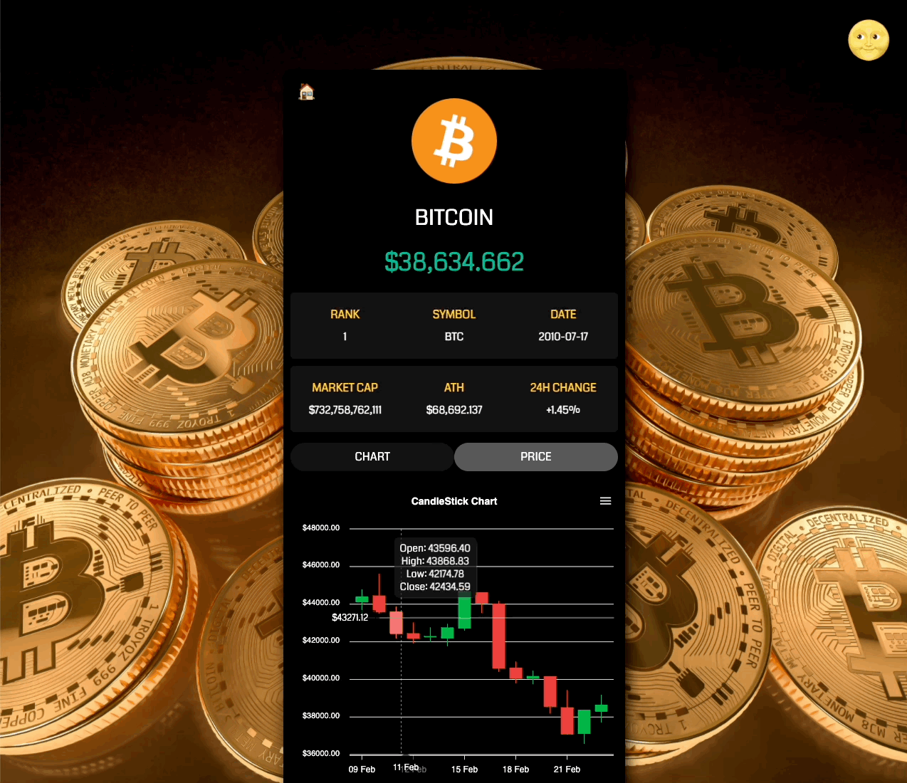

  <a href="https://githubgw.github.io/react-crypto-tracker">
    
      
    <a display="block" href="https://githubgw.github.io/react-crypto-tracker">https://githubgw.github.io/react-crypto-tracker</a>
      
    
  </a>

## Table of contents

- 🔥 [Built with](#built-with)
- 🌈 [Project](#project)
- 📑 [Pages](#pages)
- ⚙ [Features](#features)
- 📝 [License](#license)

## Built with

### Front-end

- `React`
- `Typescript`
- `Recoil`
- `React Query`
- `Styled Components`
- `Apexcharts`

### Deploy

- `GitHub`

## Project

> 1. 코인 정보, 다크 모드

- React Query를 이용해 암호화폐 API의 데이터를 가져와서 실시간으로 변하는 코인의 정보를 보여줍니다.
- Styled Components와 Recoil을 이용해 라이트, 다크모드 전환을 구현하였습니다.
    
  

> 2. 데이터 시각화, 무한 스크롤

- Apex Charts를 이용해 암호화폐의 가격 변동을 시각화하여 차트로 보여줍니다.
- 무한 스크롤을 통해 스크롤 시, 모든 코인의 정보를 확인할 수 있습니다.
    
  

## Pages

> Root

- 홈

> Coin

- 코인
- 차트
- 가격

## Features

### 💰 Coin

- [x] 코인 정보
- [x] 다크 모드
- [x] 데이터 시각화
- [x] 무한 스크롤

## License

MIT
